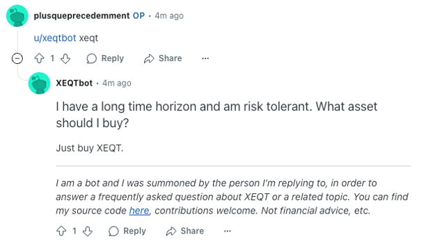

# XEQTBot

## What?

This is the source code for [/u/XEQTbot](https://www.reddit.com/user/XEQTbot/)

## Why?

People always ask the same questions on [/r/JustBuyXEQT](https://www.reddit.com/r/JustBuyXEQT). I got tired of giving the same answers so I made a bot that can be triggered to post the answers to save myself and other some time.

## How?

Simply tag /u/XEQTbot anywhere in a comment along with the appropriate [trigger word](./triggers.md) immediately after the tag and he will show up.

  

## Your FAQ is incorrect or incomplete, you are stupid

Please submit a PR! All you have to do is edit the appropriate `.md` file in [./faq](./faq) and once it's merged, your update should be reflected the next time XEQTbot is summoned (DMs are checked every 5 minutes). If you are creating a new `.md` file in [./faq](./faq), please give it a descriptive yet succinct name, and register its corresponding trigger word(s) in [this file](./triggers.md).

When contributing, please keep in mind that the target audience is one who may be new at investing with limited knowledge. Use easy to understand terms and link to other beginner friendly sources like Ben Felix, existing resources from /r/PersonalFinanceCanada, Canadian Couch Potato, Bogleheads, etc.
